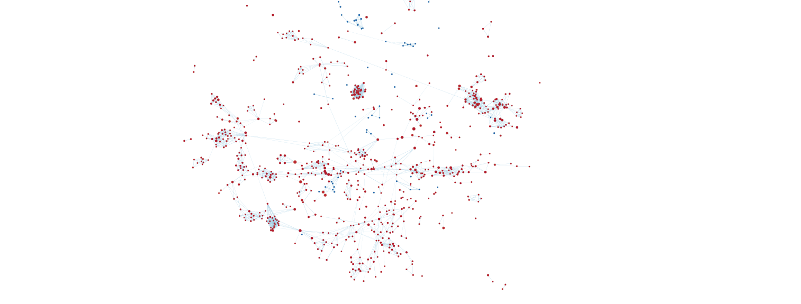
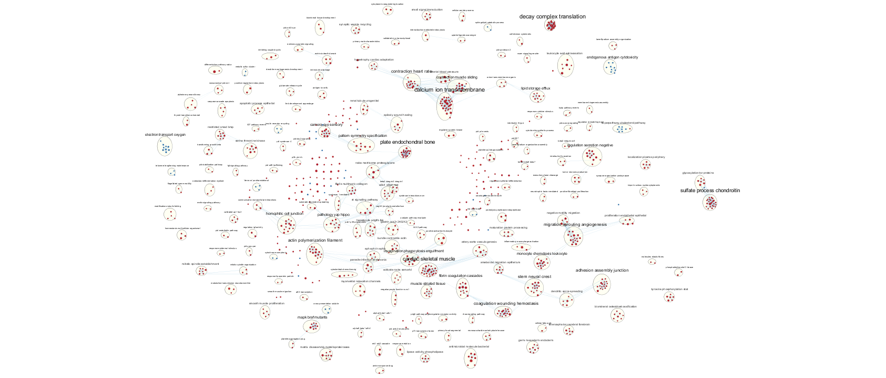
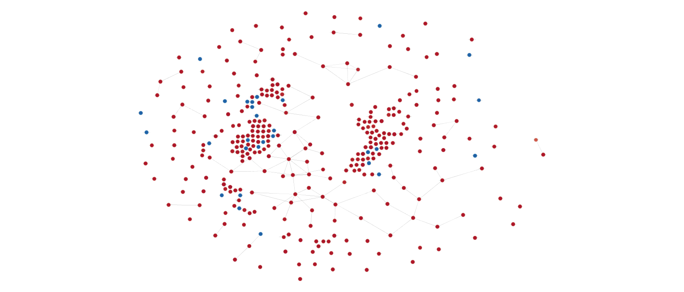
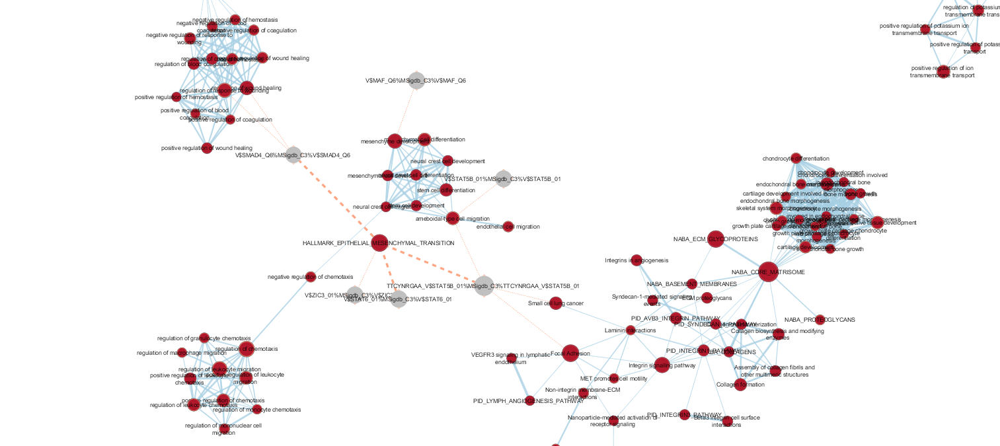
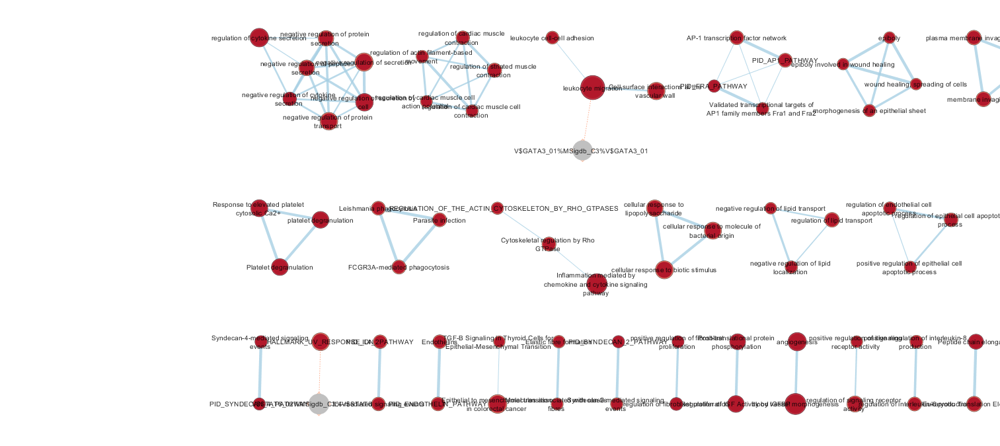

# Introduction

Human cytomegalovirus (Human betaherpesvirus 5, HCMV, CMV) infections are found across a large proportion of the human population, though usually latent and asymptomatic (@nogalski2019tumor). However, they can sometimes cause infection in immunosuppressed individuals and have been associated with certain cancers (@griffiths2015pathogenesis) - in particular being observed to be induce a significant increase in transcription of HSATII, known to be associated with gene regulation of many different processes and implicated in many cancers (@hall2017demethylated).
To test the effects of HCMV infection on cells, Human lung fibroblasts (MRC-5/MRC5), human retinal pigment epithelial (ARPE-19), and human foreskin fibroblasts (HFF) were infected with HCMV as well as herpes simplex virus (HSV1) and adenovirus serotype 5 (Ad5) as comparisons/controls, and RNASeq data taken from each sample using Illumina HiSeq 2000 (@hall2017demethylated). The dataset consists of 60725 transcripts in total, of which 16600 genes were used for analysis after preprocessing to filter out low counts and mapping to HUGO identifiers.

The CMV-infected MRC5 fibroblasts were selected to be compared against the mock-infected negative controls for this analysis, due to wide variation between the expression profiles of the different cell type and infection agents tested. Initial pre-analysis showed a stark difference in the expression levels of many genes between the two treatments. A Thresholded Over-Representation Analysis using the GO, Reactome, and WikiPathways genesets further revealed a strong association with biosynthenic pathways in those upregulated in the HCMV-infected cells, and a strong association with cell structure/intercellular interactions as well as signalling pathways in those sets downregulated relative to the mock-infected cells. These findings were consistent with the hypothesis of the paper, which found that cells infected by the herpesvirus showed a significant phenotypic resemblance to cancer cells (@nogalski2019tumor).  

# Data Set Pathway and Network Analysis (Results from Assignment 3)

## Non-Thresholded Gene Set Enrichment Analysis

```{r message=FALSE}
# Non-thresholded enrichment analysis - code adapted from Ruth Isserlin (2019)

# Install required R and bioconductor packages
tryCatch(expr = { library("RCurl")}, 
         error = function(e) {  install.packages("RCurl")}, 
         finally = library("RCurl"))

# Use libraries
tryCatch(expr = { library("limma")}, 
         error = function(e) { source("https://bioconductor.org/biocLite.R")
           biocLite("limma")}, 
         finally = library("limma"))
tryCatch(expr = { library("Biobase")}, 
         error = function(e) { source("https://bioconductor.org/biocLite.R")
           biocLite("Biobase")}, 
         finally = library("Biobase"))
tryCatch(expr = { library("ggplot2")}, 
         error = function(e) { install.packages("ggplot2")}, 
         finally = library("ggplot2"))

# path to GSEA jar 
# In order to run GSEA automatically you need to specify the path to the gsea jar file.
# With the latest release of gsea (4.0.2) they no longer release a bundled jar
# and instead release a scriptted way to launch the gsea client.
# specify the java version as 11 if you are using the later version gsea
# the gsea_jar also needs to be the full path to the GSEA 4.0.2 directory that you
# downloaded from GSEA. for example (/Users/johnsmith/GSEA_4.0.2/gsea-cli.sh)
gsea_jar <- "/home/bioc/rstudio/GSEA_4.0.2/gsea-cli.sh"
java_version <- 11

#navigate to the directory where you put the downloaded protocol files.
working_dir <- "GSEA_Files"

#Gsea takes a long time to run.  If you have already run GSEA manually or previously there is no need to re-run GSEA.  Make sure the gsea results are in the current directory and the notebook will be able to find them and use them.
gsea_directories <- list.files(path = working_dir, pattern = "\\.GseaPreranked")
if(length(gsea_directories) > 0){
  run_gsea = FALSE
} else {
  run_gsea = TRUE
}

# leave blank if you want the notebook to discover the gsea directory for itself
#gsea_directory = paste(working_dir,"Mesen_vs_Immuno.GseaPreranked.1497635459262",sep="/") 
gsea_directory = ""
analysis_name <- "Infected_Fibroblast_GSEA"
rnk_file <- "rnk_file.rnk"
expression_file <- "expression_file.gct"
classes_file <- "classes_file.cls"

#list all the files on the server
gmt_url = "http://download.baderlab.org/EM_Genesets/current_release/Human/symbol/"
filenames = getURL(gmt_url)
tc = textConnection(filenames)
contents = readLines(tc)
close(tc)

#get the gmt that has all the pathways and does not include terms inferred from electronic annotations(IEA)
#start with gmt file that has pathways only
rx = gregexpr("(?<=<a href=\")(.*.GOBP_AllPathways_no_GO_iea.*.)(.gmt)(?=\">)",
              contents, perl = TRUE)
gmt_file = unlist(regmatches(contents, rx))

dest_gmt_file <- file.path(working_dir, paste("Supplementary_Table3_", gmt_file, sep="") )

download.file(
    paste(gmt_url,gmt_file,sep=""),
    destfile=dest_gmt_file
)

#if you are using GSEA 4.0.2 then you need to use the command script
# as opposed to launching GSEA through java. 
# in the later version of GSEA command line implementation the following 
# parameters are no longer valid: -permute gene_set,  -num 100, -gui false
# no longer need to specify the whole path to the GseaPreranked package
if(run_gsea && java_version == "11"){
  command <- paste("", gsea_jar,  "GSEAPreRanked -gmx", dest_gmt_file, "-rnk",
          file.path(working_dir, rnk_file), 
          "-collapse false -nperm 1000 -scoring_scheme weighted -rpt_label ", 
          analysis_name, 
          "  -plot_top_x 0 -rnd_seed 12345 -set_max 200 -set_min 15 -zip_report false -out",
          working_dir, " > gsea_output.txt", sep=" ")
  #command <- paste("", gsea_jar,  "GSEAPreRanked -gmx", dest_gmt_file, 
  #        "-collapse false -mode Max_probe -norm meandiv -nperm 1000 -rnk",
  #        file.path(working_dir, rnk_file), 
  #        "-scoring_scheme weighted -rpt_label ", analysis_name, 
  #        " -create_svgs false -include_only_symbols true -make_sets true -plot_top_x 0 -rnd_seed 12345 -set_max 200 -set_min 15 -zip_report false -out",
  #        working_dir, " > gsea_output.txt", sep=" ")
  system(command)
} else if (run_gsea) {
  command <- paste("java  -Xmx1G -cp", gsea_jar,  "xtools.gsea.GseaPreranked -gmx",
                   dest_gmt_file, "-rnk", file.path(working_dir,rnk_file), 
                   "-collapse false -nperm 1000 -permute gene_set -scoring_scheme weighted
                   -rpt_label ", analysis_name, 
                   "  -num 100 -plot_top_x 20 -rnd_seed 12345  -set_max 200 -set_min 15
                   -zip_report false -out", working_dir, "-gui false > gsea_output.txt", 
                   sep=" ")
  system(command)
}

```

A non-thresholded gene set enrichment analysis was also performed on the gene expression data with GSEA 4.0.2 (@mootha2003pgc, @subramanian2005gene) and code from @baderlab_em_pipeline, using the log-fold difference in the gene expression and the latest non-electronically inferred human genesets (as of April 2, 2020) from the Bader Lab (@merico2010enrichment).

```{r gseaUpregulated, message=FALSE, warning=FALSE, fig.align='center'}
if(gsea_directory == ""){
  gsea_directories <- list.files(path = working_dir, pattern = "\\.GseaPreranked")

  #get the details on the files
  details = file.info(file.path(getwd(),working_dir,gsea_directories))
  #order according to newest to oldest
  details = details[with(details, order(as.POSIXct(mtime),decreasing = TRUE)), ]

  #use the newest file:
  gsea_output_dir <- row.names(details)[1]
} else {
  gsea_output_dir <- gsea_directory
}

gsea_output_number <- substring(gsea_output_dir, 
                                regexpr("\\.[^\\.]*$", gsea_output_dir)[[1]] + 1)
gsea_positive_report <- paste(gsea_output_dir, "/gsea_report_for_na_pos_", 
                              gsea_output_number, ".xls", sep = "")
gsea_negative_report <- paste(gsea_output_dir, "/gsea_report_for_na_neg_", 
                              gsea_output_number, ".xls", sep = "")

# Need to parse tables manually because read.table does not work
parse_gsea_data <- function(fileName) {
  lines <- read.table(file = fileName, sep = '\n', header = FALSE)
  
  # Split all lines by tab
  split_lines <- (lapply(lines, stringr::str_split, pattern = '\t'))$V1
  
  # Convert to data frame
  gsea_data <- as.data.frame(do.call(rbind, split_lines[-1]))
  colnames(gsea_data) <- split_lines[1][[1]]
  
  # Clean up data frame
  gsea_data <- gsea_data[c(-2, -3, -12)] # Empty/duplicate columns
  split_name <- (lapply(gsea_data[1], stringr::str_split, pattern = '%'))$NAME
  split_name_frame <- as.data.frame(do.call(rbind, split_name))
  split_name_frame <- split_name_frame[-4]
  colnames(split_name_frame) <- c("NAME", "SOURCE", "CODE")
  gsea_data <- cbind(split_name_frame, gsea_data[-1])
  
  return(gsea_data)
}

# NOTE: na_negative = HCMV-infected (i.e. upregulated)
gsea_negative_table <- parse_gsea_data(gsea_negative_report)

knitr::kable(gsea_negative_table[1:30, c(-3)], type="html", 
             caption = "Gene Set Enrichment Analysis for Upregulated Genes")
```

Table \@ref(tab:gseaUpregulated) shows the top genesets found by GSEA in upregulated (HCMV-infected) cell expression data, which similarly to the Thresholded ORA has a significant proportion of biosynthetic pathways. Interestingly, there are also a large number of genes related to cellular metabolism and a few for protein synthesis, categories that were not observed in the Thresholded ORA but fit well in the context of the cancer-like activity observed of the HCMB-infected cells, given their propsenity for rapid growth and reproduction.

```{r gseaDownregulated, warning=FALSE, fig.align='center'}

# NOTE: na_positive = mock-infected (i.e. downregulated)
gsea_positive_table <- parse_gsea_data(gsea_positive_report)

knitr::kable(gsea_positive_table[1:30, c(-3)], type="html", 
             caption = "Gene Set Enrichment Analysis for Downregulated Genes")
```

Like the Thresholded ORA analysis, signalling and structural gene sets were observed as downregulated in the HCMV cells (Table \@ref(tab:gseaDownregulated)). Notably, however, the largest category of sets here are those relating to cell development and differentiation, which was not observed in the Thresholded ORA. This, however, still ties in well with the observation that HCMV-infected cells acquire a cancer-like phenotype and expression profile, as a loss of differentiation is often associated with cancer.

The comparison between the two gene set analyses is fairly straightforward in that the top sets at each side were generally consistent with each other, at least insofar as it all supports to general hypothesis. However, there does generally remain issues with how many of the top genests should be compared - while Thresholded ORA provides a clear cutoff at which the sets are no longer considered, Non-Thresholded GSEA is more ambiguous as to this.

## Visualizing Gene Set Enrichment Analysis in Cytoscape

```{r basicEMMap, fig.align='center', fig.cap="Enrichment Map of Non-Thresholded GSEA Results (Coloured by Enriched Infection Type - HCMV (Blue), Mock (Red))"}

```

The Non-Thresholded GSEA results were visualized (Figure \@ref(fig:basicEMMap)) using the EnrichmentMap App on Cytoscape (@merico2010enrichment, @shannon2003cytoscape). As all of the genes enriched in the upregulated/HCMV-infected cells have a high rather than low Q-value, filtering was done with the P-value, using a threshold of 0.075, and the default edge similarity cutoff of 0.375 was used. There are 1046 nodes and 3146 edges in the network.

```{r annotatedEMMap, fig.align='center', fig.cap="Annotated Enrichment Map of Non-Thresholded GSEA Results (Coloured by Enriched Infection Type - HCMV (Blue), Mock (Red))"}

```

The network was annotated using the AutoAnnotation app, largely using the default parameters (MCL clustering algorithm with similarity_coefficient edge weight and GS_DESCR to create the labels), but with the granularity parameter for the MCL clustering algorithm reduced to 2.0 to get larger clusters (Figure \@ref(fig:annotatedEMMap)). Many of the clusters were related to the general categories identified earlier (e.g. actin polymerization filament, decay complex translation, superpathway cholesteral pathway) with the expected bias towards downregulated categories (given most of the nodes were downregulated). Interestingly there were a number of clusters relationing to muscles (cardiac skeletal muscle, contraction muscle sliding) which do not seem obviously related to the general cancer theme/hypothesis but may be a subset of the developmental/differentiating gene sets identified earlier, as well as a number of others which stood out as novel (e.g. plate endochondrial bone, coagulation wounding homeostasis) but don't seem to have a common theme.

```{r themeEMMap, fig.align='center', fig.cap="Theme Summary Network of Non-Thresholded GSEA Results (Coloured by Enriched Infection Type - HCMV (Blue), Mock (Red))"}

```

Finally, the clusters were collapsed and made into a theme network (Figure \@ref(fig:themeEMMap)), 328 nodes and 82 edges in all (most of the nodes in the original network were unconnected singletons or small clusters). There is, however, one fairly large network connecting a number of clusters together (corresponding to the largest cluster of the original network), which consists largely of signalling and developmental pathway-related clusters.

## Interpretation and Detailed View of Results

```{r}
# Download the full human disease phenotype file
download.file(
    "http://download.baderlab.org/EM_Genesets/April_01_2020/Human/symbol/TranscriptionFactors/Human_TranscriptionFactors_MSigdb_April_01_2020_symbol.gmt",
    destfile="Human_TranscriptionFactors_symbol.gmt"
)
geneset_lines <- (read.table(file = "Human_TranscriptionFactors_symbol.gmt", 
                     sep = '\n', header = FALSE))$V1
split_lines <- (lapply(geneset_lines, stringr::str_split, pattern = '\t'))
oncogenic_tfs <- stringr::str_split("ATM	DACH1	FOXA1	IRF6	NCOA1	PRDM1	STAT5B	WT1
ATRX	DACH2	FOXE1	IRF8	NCOA2	PRDM16	STAT6	WWP1
BAZ2B	DAXX	FOXL2	IRX6	NCOA4	PRDM9	SUFU	WWTR1
BCL11A	DDB2	FOXP1	JUN	NCOR1	PRRX1	SUZ12	XBP1
BCL11B	DDIT3	FOXQ1	KHDRBS2	NCOR2	PSIP1	TAF1	XPC
BCL3	DDX5	FUBP1	KHSRP	NEUROG2	RARA	TAF15	ZBTB16
BCL6	DEK	FUS	KLF2	NFE2L2	RB1	TAL1	ZBTB20
BCLAF1	DIP2C	FXR1	KLF4	NFE2L3	RBM15	TAL2	ZFP36L1
BCOR	DNMT1	GATA1	KLF5	NFIB	RBMX	TBX18	ZFX
BRCA1	DNMT3A	GATA2	KLF6	NFKB2	REL	TBX22	ZHX2
BRCA2	DOT1L	GATA3	LDB1	NFKBIA	RUNX1	TBX3	ZIC3
BRD7	EED	GLI3	LMO1	NONO	RUNX1T1	TCEA1	ZIM2
BRD8	EGR2	GTF2I	LMO2	NOTCH2	RXRA	TCEB1	ZNF208
BRIP1	ELAVL2	HDAC9	LMX1A	NOTCH3	SALL3	TCERG1	ZNF226
BRPF3	ELF3	HEY1	LYL1	NPM1	SATB2	TCF12	ZNF331
BTG1	ELF4	HIST1H1B	LZTR1	NR3C2	SETBP1	TCF3	ZNF384
BTG2	ELK4	HIST1H1C	MAF	NR4A3	SFPQ	TCF7L2	ZNF469
CBFA2T3	ELL	HIST1H1D	MAFA	NSD1	SIN3A	TFAP2D	ZNF595
CBFB	EP300	HIST1H1E	MAFB	OLIG2	SMAD2	TFDP1	ZNF638
CDX2	EPC1	HIST1H2BC	MAML1	PAX3	SMAD4	TFE3	
CDX4	ERCC2	HIST1H2BD	MAX	PAX5	SMARCA1	TFEB", pattern = '\t|\n')[[1]]

is_oncogenic_tf_geneset <- function(geneset) {
  split_line <- stringr::str_split(geneset, pattern = '\t')
  tf_name <- stringr::str_split(split_line[[1]][1], pattern = "%")[[1]][3]
  
  # Strip initial V$
  split_tf_name <- stringr::str_split(tf_name, pattern = "\\$")[[1]]
  if (length(split_tf_name) > 1 && nchar(split_tf_name[2]) > 0)
    tf_name <- split_tf_name[2]
  
  # Strip number at end
  split_tf_name2 <- stringr::str_split(tf_name, pattern = "_")[[1]]
  if (length(split_tf_name2) > 1)
    tf_name <- split_tf_name2[1]
  
  return(tf_name %in% oncogenic_tfs)
}
filtered_genesets <- Filter(is_oncogenic_tf_geneset, geneset_lines)
write.table(filtered_genesets, file = "Human_TranscriptionFactor_symbol_oncogenic.gmt", 
            row.names = FALSE, col.names = FALSE, quote = FALSE)
```

To further investigate the phenotype of the HCMV-infected cells, a post analysis was performed on the network using a set of known cancer transcription factors (@lambert2018targeting). As preprocessing, set of oncogenic transcription factors was intersected with the April 2020 HGNC Symbol Human Transcription Factor genesets from the Bader Lab (@merico2010enrichment).

```{r postanalysisEMMap1, fig.align='center', fig.cap="Part of Oncogenic Transcription Factor Post Analysis of Non-Thresholded GSEA Results Network (Coloured by Enriched Infection Type - HCMV (Blue), Mock (Red))"}

```

```{r postanalysisEMMap2, fig.align='center', fig.cap="Part of Oncogenic Transcription Factor Post Analysis of Non-Thresholded GSEA Results Network (Coloured by Enriched Infection Type - HCMV (Blue), Mock (Red))"}

```

The post analysis network (Figures \@ref(fig:postanalysisEMMap1), \@ref(fig:postanalysisEMMap2)) was done using the EnrichmentMap app of Cytoscape. Due to issues with filtering an enrichment map by P-value as done earlier, an enrichment filtered by Q-value with a threshold of 0.25 was used for this part, which meant that only genes downregulated in the HCMV-infected cells were used in the post analysis. The analysis itself was done using the Mann-Whitley (One-Sided Greater) algorithm with a threshold of 0.001 in order to filter to only the most relevant sets, of which 8 were found, with two apparent duplications - STAT6 (twice), SMAD4, STAT5B (twice), ZIC3, GATA3, and MAF. The most notable are STAB5 (stabilin-5), which connects to a number of nodes relating to structure and migration (e.g. epithelial-mesenchymal transition, focal adhesion, ameboidal-type migration) but is largely unattested in the literature, and SMAD4 (Mothers against decapentaplegic homolog 4), a signalling protein involved in many pathways (@zhao2018role) here with links to epithelial-mesenchymal transition as well as two wound healing gene sets.

The Non-Thresholded enrichment results, while a little bit different from the Thresholded ORA results, nonetheless do still strongly support support the conclusions of the paper that herpesvirus induces a cancer-link phenotype. As in the Thresholded ORA, biosynthetic pathways are upregulated, but the Non-Thresholded GSEA also showed enrichment for metabolic pathways and energy production as well as protein biosynthesis. Both, however, are well consistent with the conclusion and increased metabolism is a long-standing observation of cancer cells (@romero2011tumor), and both of these themes are rather complementary to the upregulation of biosynthetic pathways and fully consistent with the propensity of cancer cells to focus more towards growth and reproduction (@@nogalski2019tumor).

As previously observed, cell signalling pathways were downregulated as consistent with the literature (@ho2015clinical, @martini2014pi3k), a novel observation was that of downregulation of genesets and pathways relationg to cell development and differentiation. This may be connected to the tendency for cancer cells to increasingly lose their resemblance to and functionality of their original cell type and often adopt a more epithelial-like phenotype (@roche2018epithelial), all the more apparent in the network clusters associated with various tissues and organs, which at first glance are unobviously associated with cancer but on closer inspection generally relate to their development and differentiation. 

# References